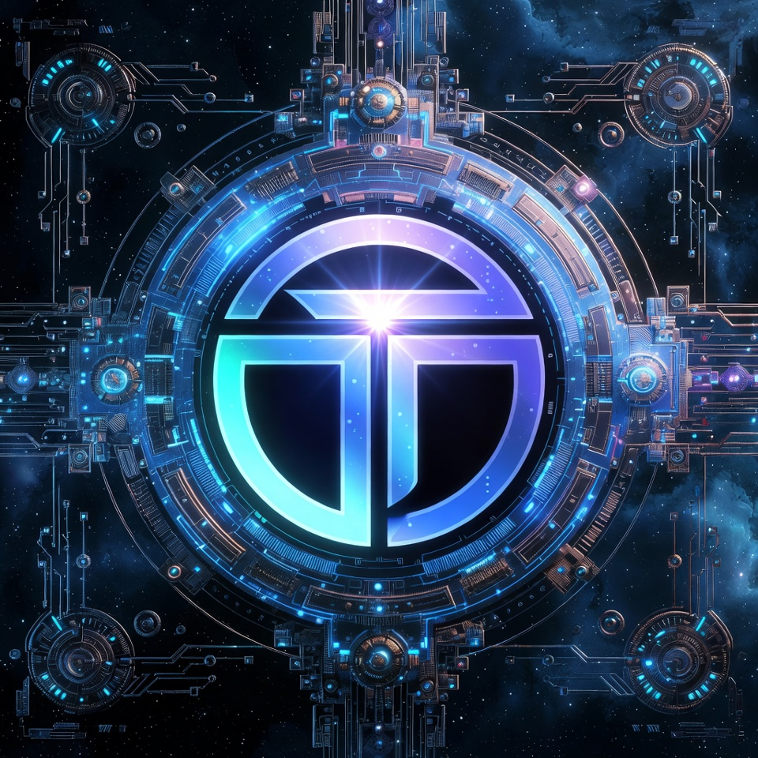
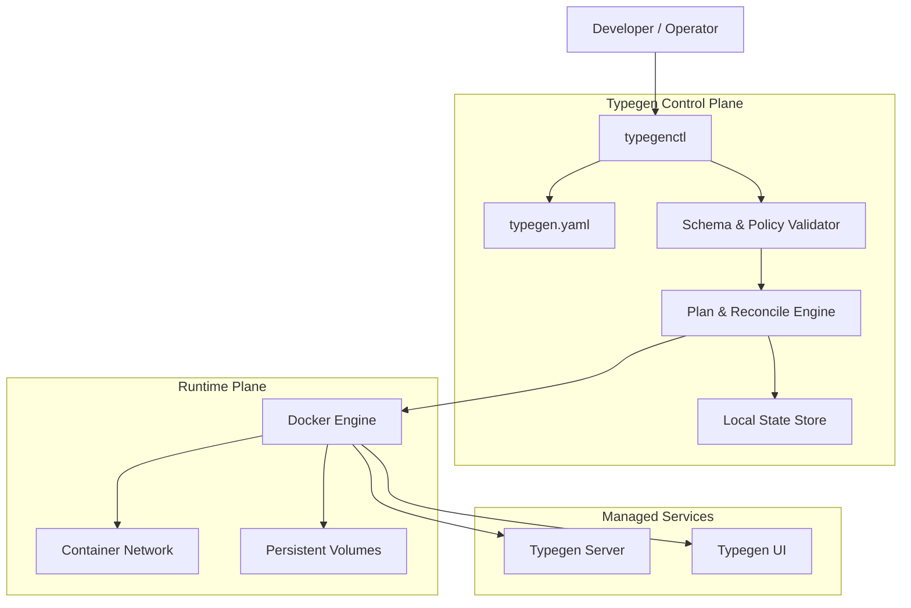
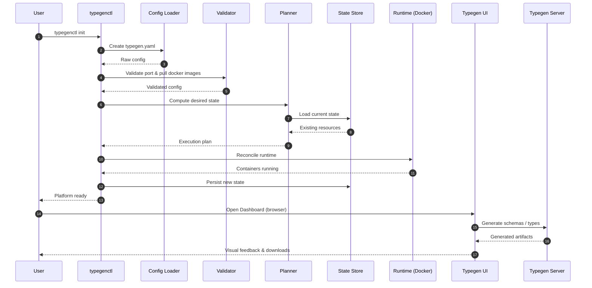
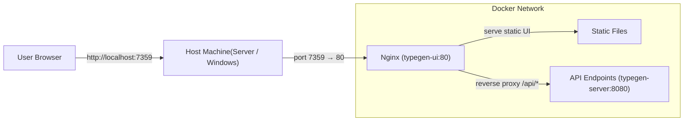

# Type Generator

<p align="center">
  
</p>

<p align="center">
  <strong>System controller for the Typegen ecosystem</strong><br/>
  Deterministic • Safe • Production‑ready
</p>

<p align="center">
  
  
  
  
</p>

---

## 💼 Introduction

**TypeGenerator** is an open-source **type generator** and **code generation platform** for generating, managing, and
synchronizing types across APIs, backend services, and frontend applications.

In modern systems, inconsistent schemas and manually maintained models often lead to runtime errors and slow
development. TypeGenerator solves this by acting as a **centralized type generator** with a single source of truth for
schema-driven type generation.

The platform consists of three core parts:

* **Typegenctl (CLI)** — controls type generation, configuration, and lifecycle
* **TypeGenerator Server (API)** — validates schemas and orchestrates generation workflows
* **TypeGenerator UI (Dashboard)** — manages schemas and provides system visibility

TypeGenerator supports **schema-based**, **CLI-first**, and **API-driven** workflows, making it suitable for monoliths,
microservices, and hybrid architectures. It is built as a **production-grade, full-stack type generator** with a strong
focus on developer experience, determinism, and operational safety.

### 🎥 Installation & Usage Demo
<p align="center">
  
</p>

<p align="center">
  <strong>End-to-end flow:</strong> Import schema → Generate types → Sync across services → Validate changes
</p>

🔗 **Full documentation & setup guide:**  
- 👉 https://github.com/khanalsaroj/typegen-server
- 👉 https://github.com/khanalsaroj/typegen-ui

### Key Features

* Centralized **type generator** for backend and frontend systems
* Deterministic and repeatable **code generation**
* CLI-driven and API-driven workflows
* Web dashboard for visibility and configuration
* Designed for long-term maintainability and extensibility

---

## ⚙️ Installation

### 🐧 Linux  (requires `curl`)

```bash
curl -fsSL https://raw.githubusercontent.com/khanalsaroj/typegenctl/refs/heads/main/main/install.sh | bash
```

### 🪟 Windows (PowerShell installer)

Open **PowerShell as Administrator**:

```powershell
Set-ExecutionPolicy RemoteSigned -Scope CurrentUser
```

```powershell
iwr -useb https://raw.githubusercontent.com/khanalsaroj/typegenctl/refs/heads/main/main/install.ps1 | iex
```

> ***Restart your terminal after installation.***

### Verify Installation

```bash
typegenctl --version
```

Or download a prebuilt binary for your platform from the [Releases](https://github.com/khanalsaroj/typegenctl/releases)
page.

---

## 🚀 Getting Started

```bash
typegenctl init                 # Generate default configuration (typegen.yaml)
typegenctl pull                 # Pull required Docker images
typegenctl run                  # Start the Typegen service stack
typegenctl status               # Check health and status of services
typegenctl dashboard            # Open the dashboard in your default browser
```

---

### ▶️ Commands

| Command       | Description                                                           |
|:--------------|:----------------------------------------------------------------------|
| `init`        | Bootstrap the environment and generate `typegen.yaml`.                |
| `check`       | Validate configuration, host prerequisites, and Docker availability.  |
| `pull`        | Fetch and verify required Docker images.                              |
| `run`         | Start the Typegen services (creates and starts containers).           |
| `start`       | Start existing (but stopped) Typegen containers.                      |
| `stop`        | Gracefully stop running containers without removing them.             |
| `restart`     | Restart service containers.                                           |
| `status`      | Inspect and report the current runtime state.                         |
| `update`      | Pull the latest images for the services.                              |
| `cleanup`     | Remove obsolete Docker images and stopped containers.                 |
| `self-update` | Update the typegenctl CLI to the latest released version from GitHub. |
| `dashboard`   | Open the Typegen user interface (UI) in the browser.                  |

---

### ▶️ Global & Common Flags

Available for most commands:

| Flag                      | Description                                               |
|:--------------------------|:----------------------------------------------------------|
| `--config <path/to/file>` | Full path to the `typegen.yaml` file, including its name. |
| `--json`                  | Output results in JSON format.                            |
| `--dry-run`               | Show planned actions without executing them.              |
| `--version`, `-v`         | Print version information.                                |

**Service Selection Flags** (Available for `init`):

| Flag                      | Description                                                                                   |
|:--------------------------|:----------------------------------------------------------------------------------------------|
| `--frontend <port>`       | Set the frontend service port (default: 3000).                                                |
| `--backend <port>`        | Set the backend service port (default: 8080).                                                 |
| `--force`                 | Overwrite existing `typegen.yaml` if it exists.                                               |
| `--config <path/to/file>` | Full path to the `typegen.yaml` file, including its name file will be created or overwritten. |

**Service Selection Flags** (Available for `self-update`):

| Flag      | Description                                      |
|:----------|:-------------------------------------------------|
| `--check` | Check for available updates without installing.  |
| `--force` | Reinstall even if already on the latest version. |

**Service Selection Flags** (Available for `run`, `stop`, `start`, `restart`, `pull`, `status`, `update`, `cleanup`,
`check`):

| Flag         | Description                                 |
|:-------------|:--------------------------------------------|
| `--frontend` | Apply command to the frontend service only. |
| `--backend`  | Apply command to the backend service only.. |

---

## 🔧 Configuration

The CLI uses a `typegen.yaml` file for configuration. By default, it looks for this file in the path specified during
`init` (defaulting to the local directory or internal path).

```yaml
services:
  frontend:
    image:
      name: ghcr.io/khanalsaroj/typegen-ui
      tag: latest
    container_name: Frontend
    port:
      host: 7359
      container: 80
    enabled: true

  backend:
    image:
      name: ghcr.io/khanalsaroj/typegen-server
      tag: latest
    container_name: Backend
    port:
      host: 8049
      container: 8080
    enabled: true
```

---

## 🤖 **Typegenctl**

**Typegenctl** (`typegenctl`) is the control plane of the Typegen platform. It is a statically compiled, single-binary
CLI written in Go that orchestrates the lifecycle of Typegen services (Server and UI) using Docker.

It provides deterministic lifecycle management, configuration validation, runtime status inspection, and safe execution
of operational workflows for both local development and production environments.

The Typegen platform is composed of **three first‑class components**, each with a clear and isolated responsibility:

### 1. Typegenctl

The control plane of the platform.

* Statically compiled, single‑binary CLI
* Orchestrates the full Typegen system lifecycle
* Validates configuration and runtime safety
* Acts as the **only required entry point** for operators and developers

### 2. Typegen Server

The core execution engine.

* Processes schemas and contracts
* Generates language‑specific types
* Exposes deterministic APIs for automation
* Designed to be stateless and horizontally scalable

📖 **Documentation:** [Typegen Server](https://github.com/khanalsaroj/typegen-server?tab=readme-ov-file)

### 3. Typegen UI

The user interface layer.

* Visual schema and project management
* Service status and health visibility
* Developer‑friendly workflows
* Connects exclusively through the Typegen API

📖 **Documentation:** [Typegen UI](https://github.com/khanalsaroj/typegen-ui?tab=readme-ov-file)


---

## 🧭 System Architecture

### 1. Control Flow



### 2. Data Flow



### 3. Application Request Routing (Nginx Reverse Proxy)



---

## ♻️ Planned Enhancements

### 1. Platform & Language Support

* **Additional database connections**: Oracle, SQLite, and MongoDB (NoSQL)
* **Additional target languages**: Kotlin, Python, and Go

### 2. DTO / Type Generation

* Expanded customization options when generating DTOs and types
* Greater control over naming, structure, and type mapping
* Smarter defaults while allowing full user override

### 3. AI-Assisted Features

* Intelligent naming suggestions for models, fields, and types
* Context-aware type inference and recommendations powered by AI

### 4. CLI Improvements

* The CLI will support **custom file names and flexible directory structures**
* Instead of relying on a single default file name, the CLI will:

    * Discover and load **all configuration files with the `.typegen.yaml` extension**
    * Aggregate all defined servers from those files
    * Execute generation across **all detected services** in a single run

### 5. Testing

* Test cases will be included starting from the next release
* Coverage will include DTO generation, CLI behavior, and multi-service execution

## 🔍 Contact

- **Issues:** [Report bugs and feature requests](https://github.com/khanalsaroj/typegenctl/issues)
- **Developer:** Khanal Saroj (waytosarojkhanal@gmail.com)

---

## 📝 Personal Note

> Typegen — no need to expose your entire database schema to LLMs..
>
> After four years of writing Java, I decided to step outside looking for something new.
> This project was built in Go, with zero prior experience and a healthy amount of confusion.
>
> Could this be docker-compose? Yes, this could have been a simple docker-compose setup.
>
> I intentionally chose to build a full CLI instead to deeply learn CLI design, service orchestration, and developer
> tooling.
>
> Did I do it the hard way to learn CLI design? Also yes.
>
> Would I do it again? Maybe. Probably.
>
> Thanks, Caffeine and LLMs. It is what it is.
